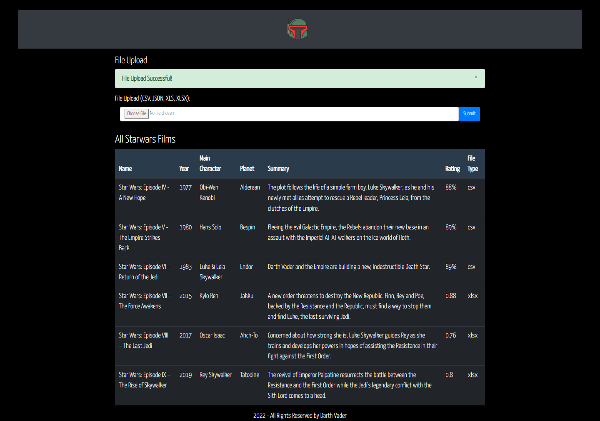

# Project Name: READ STARWARS DATA

## Project Description

Read Starwars Data is Java - SringBoot MVC CRUD Application that allows reading various data formats such as CSV, JSON, XML, XSLX, XML and SQL files and store them in a PostgreSQL DB with a further functionality to enable CRUD operations. on the data.

## Setup Instructions

### Backend

The backend of this project uses the Java programming language. To implement and run the project locally, the following are the step to step setup instructions:

- Use the STS IDE to import the clone of this project as a Maven Project. - Update the Maven Projct to have all required packages installed as jars.

- Check the pom.xml file to ensure you have the "spring-boot-starter-web", the "spring-boot-starter-data-jpa" and apache-derby dependancy.

- Run the simple test class below provided by SpringBoot to have the application return the string "Hi" on the URL http://localhost:8080/hello

            import org.springframework.web.bind.annotation.RequestMapping;
            import org.springframework.web.bind.annotation.RestController;

            @RestController //Annotation to notify that this is a Spring Application
            public class HelloController {

                    @RequestMapping("/hello") //Annotation for the GET method to indicate the routing path
                    public String sayHi() {

  return "Hi";
  }
  }

- If everything up this point seems fine run the application and test the api endpoint http://localhost:8080/ on the browser.

### Dependancies

This application relies heavily on the dependancies to manage different external files. These files include:-

- Spring Web - Build web, including RESTful, applications using Spring MVC. Uses Apache Tomcat as the default embedded container.
- Spring Data JPA - Persist data in SQL stores with Java Persistence API using Spring Data and Hibernate.
- Postgresql Driver - A JDBC and R2DBC driver that allows Java programs to connect to a PostgreSQL database using standard, database independent Java code.
- Spring Boot DevTools - Provides fast application restarts, LiveReload, and configurations for enhanced development experience.
- Thymeleaf - Allows HTML files to be correctly displayed in browsers and as static prototypes.
- Open CSV - A simple library for reading and writing CSV in Java.
- Apache POI & POI-OOXML - Java API To Access Microsoft Format Files.
- Jackson Databind - General data-binding functionality for Jackson: works on core streaming API for JSON files.
- Apache Commons IO - Contains utility classes, stream implementations, file filters, file comparators, endian transformation classes, and much more.

## BDD

Using the services on the application, the idea is to have users able to create data from external datafiles in CSV, XML, XLS, XLSX and JSON file formats.

### APIs

### Future Modifications

- Enabling the PUT and DELETE function to the data on the database.
- Enabling more error reporting capabilities when dealing with inconsistent data, special characters and null values.

## Technologies, Libraries and Frameworks Used

        - Java
        - Spring Framework
        - SpringBoot Web MVC
        - Spring Data JPA (Java Persistence API)
        - Maven to manage backend dependancies.
        - PostgreSQL Database.
        - HTML 5

### LICENSE: [MIT LICENSE](https://raw.githubusercontent.com/deepeters/read-data/master/LICENSE)
